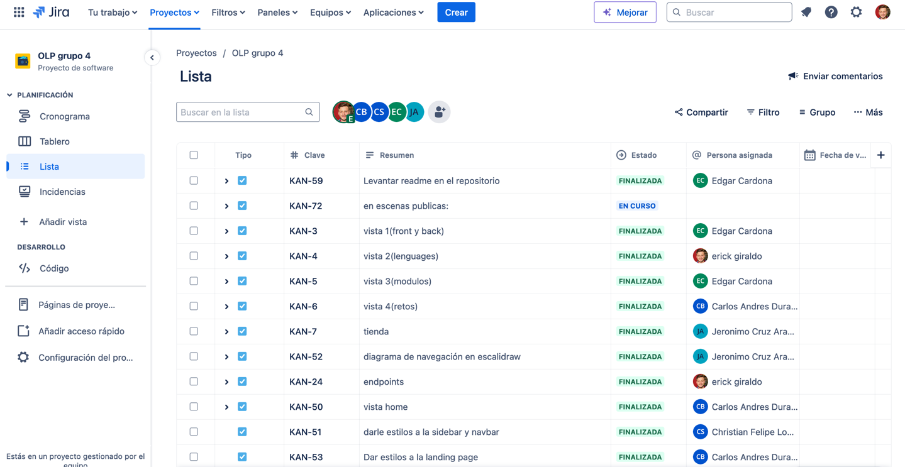
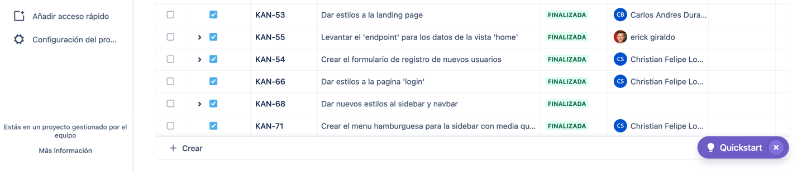

### About this project
An interactive learning platform designed for the training of future developers, it will focus on teaching a variety of languages, frameworks, and databases. The idea is that it is fun so that learning becomes much easier and anyone can understand the content through games and challenges, having as motivation points for each completed module, and allowing users to view the points of other users to encourage healthy competition.

### Project name
Singularity 

### General objective
The main mission or objective of Singularity is to provide an interactive online learning system specifically designed for the training of future developers. It aims to revolutionize the way people learn to program through its interactive content and playful approach to learning.

### Problem statement
The problem that this project seeks to solve is the existing gap in programming and web development education. Despite the growing demand for developers in the tech industry, many people find it challenging to learn to program due to the following issues:

#Accessibility: Many programming learning resources are expensive or not available to everyone. This limits access to quality programming education for many aspiring developers.
#Comprehension: Programming can be a complex and overwhelming topic for beginners. Many learning resources fail to effectively simplify programming concepts, which can discourage beginners.
#Motivation: Learning to program requires time and effort. Without proper motivation, many learners may lose interest or quit before acquiring the necessary skills.
#Practice: Programming is a practical skill, but not all learning resources offer enough opportunities to practice and apply what has been learned.

### Project Scope
The scope of Singularity includes the following:
1. **Learning Objectives**: Teach users Python or JavaScript in the first 3 weeks. Other languages and concepts can be added in later phases.
2. **Gamification Objectives**: Implement a basic point system "X coins" that is awarded upon completing modules. Additional features, such as unlocking content, can be added later.
3. **Healthy Competition Objectives**: Start with a basic leaderboard. Prizes and other forms of recognition can be implemented in later phases.
4. **User Experience Objectives**: Create a basic user interface that is easy to use. Improvements based on user feedback can be implemented in later phases.
5. **Scalability Objectives**: Build an architecture that can handle the initial number of users and courses. The architecture can be optimized for greater scalability in later phases.

Content Creation: The platform will offer a wide range of learning modules covering various programming languages, databases, the use of GitHub, frameworks, HTML, CSS, and more. Each module will be designed as a game or challenge to make learning engaging and fun.
User Progress Tracking: The platform will track the progress of users, including the modules they have completed, the points they have earned, and their overall ranking. This will allow users to see their progress and stay motivated.
Community Building: The platform will foster a sense of community among its users. Users will be able to see how many points their peers have earned, encouraging healthy competition. There will also be leaderboards and prizes for top performers.
Platform Development: The platform will be built using JavaScript, Node.js, and React. The backend will handle business logic, while the frontend will provide a dynamic and interactive user interface.
Continuous Improvement: The platform will be continuously updated and improved based on user feedback and changing industry trends. This will ensure that the platform remains relevant and effective in teaching programming skills.

### Functional requirements
1. **User Authentication**: Registration and login with secure authentication (OAuth and JWT).
2. **Basic Navigation/Friendly Interface**: Access to learning modules with clear menus and shortcuts to facilitate access to different sections./Design an intuitive UI/UX with clear visual feedback.
2.1. Responsive Design: The platform should adapt to any screen size, from mobiles to large monitors.
2.2. Color Palette: Use colors that are comfortable for the eye and clearly differentiate code sections, instructions, and menus.
2.3. Accessibility: Ensure that the platform complies with accessibility standards, such as the use of screen readers and keyboard.
Modular Content:
3. **An Interactive Learning Module**: For example, an introductory Python or JavaScript course with games and challenges.
3.1. Microlearning: Divide the courses into small lessons that can be completed in short sessions.
3.2. Contextual Help: Provide tooltips and pop-ups with useful information without overloading the screen.

4. **Basic Point System**: Assignment and display of "X coins" are awarded upon completing modules.
5. **Leaderboards**: To foster healthy competition.

6. **Modular Content**: Create learning content in small interactive modules that are both educational and entertaining.
6.1. Learning Paths: Offer different paths according to the user's level and objectives, such as "Basic Principles", "Frontend Developer", "Backend Developer", etc.
6.2. Interactive Assessments: Include quizzes and practical exercises at the end of each module to reinforce learning.
6.3 Code Quests: Adventure games where users must solve programming problems to advance in the story.
6.4 Debugging Challenges: Challenges where users must find and correct errors in code snippets.
7.0 Constant Updates: Keep the content updated with the latest trends and practices in programming.
7.1 Project Simulators: Environments that mimic real projects where users apply what they have learned to build applications.

### Activities board

Jira

A screenshot of the activities board is attached next:

### Prototype

It was used excalidraw. A screenshot of the complete mockup is attached as a link (The png file was too large)

https://excalidraw.com/#room=cd6a3b8a8726e712cbd9,vF7hSC1rs8P1Ukb3coz0GQ